# Codebase Analysis & Documentation Generation Framework

## Overview

This framework provides a comprehensive, reusable approach for analyzing any codebase and generating enterprise-grade documentation with visual diagrams. It supports multiple technologies (Java, .NET, Angular, Spring Boot, Kubernetes, etc.) and optimizes token usage through intelligent agent orchestration and MCP integration.

## Core Principles

### 0. Data Integrity (CRITICAL)
- **ALL agents MUST use only actual data from the codebase**
- **NEVER use hardcoded examples or placeholder data**
- **See `framework/templates/AGENT_DATA_INTEGRITY_RULES.md` for mandatory rules**
- **Violations will produce incorrect analysis**

### 1. Token Optimization
- **Use Serena MCP** for semantic code analysis instead of full file reads
- **Agent Memory** for cross-agent knowledge sharing
- **Targeted Searches** over exhaustive file scanning
- **Batch Processing** for similar analysis tasks
- **Smart Caching** of patterns and findings

### 2. Quality Standards
- **Minimum 50+ business rules** extraction for non-trivial systems
- **Complete sequence diagrams** for ALL business flows
- **Performance/Security heat maps** with actionable insights
- **Validated diagrams** using automated hooks
- **Cross-referenced documentation** with traceability

### 3. Extensibility
- **Pluggable agent architecture** for new technologies
- **Configurable tech stacks** via TARGET_TECH_STACK.md
- **Reusable templates** for consistent output
- **Project-specific customization** without framework changes
- **Multi-language support** through specialized agents

## Agent Orchestration Workflow

### Phase 0: Project Setup & Configuration
**Prerequisites:**
1. Configure `TARGET_TECH_STACK.md` with target technology choices
2. Place codebase in `codebase/[project-name]/` directory
3. Configure and activate MCPs (Serena, Repomix, Sourcegraph, AST Explorer)
4. Run MCP setup script: `./setup-mcp.sh`

**Token Optimization:**
- Configure MCPs based on project size and complexity
- Set up caching strategies for MCP results
- Prepare fallback options if MCPs unavailable

### Phase 0.5: MCP-Powered Pre-Analysis (NEW)
**Agent:** `@mcp-orchestrator` with `@repomix-analyzer`
**Objective:** Generate optimized codebase summary and initial insights

**Repomix Processing:**
- Generate compressed codebase package (80% token reduction)
- Run Secretlint security scan for early vulnerability detection
- Create file metrics: token counts, complexity scores, file dependencies
- Output formats: Markdown (primary), XML (backup)

**Serena Initialization:**
- Activate project: `mcp__serena__activate_project`
- Run onboarding: `mcp__serena__onboarding`
- Create initial project memories

**Sourcegraph Setup (if available):**
- Index codebase for semantic search
- Prepare cross-file pattern matching
- Enable code intelligence features

**AST Explorer Setup (if available):**
- Parse code into AST representation
- Prepare for complex pattern detection
- Generate initial complexity metrics

**Output:** 
- `docs/00-mcp-analysis-summary.md` - Compressed codebase overview
- `docs/00-security-prescan.md` - Initial security findings
- `docs/00-token-metrics.md` - Token usage optimization plan

**Token Savings:** 
- Traditional approach: 100% tokens
- With Repomix only: 20% tokens (80% reduction)
- With all MCPs: 10% tokens (90% reduction)

### Phase 1: Archaeological Analysis
**Agent:** `@legacy-code-detective`
**Objective:** Deep dive into codebase structure, dependencies, and technical debt

**Requirements:**
- Technology stack inventory with exact versions
- Hidden dependency mapping (configuration-driven, implicit)
- Framework usage patterns and anti-patterns
- Technical debt assessment with metrics
- Integration points and external dependencies
- Performance bottlenecks identification

**Token Optimization:**
- Use `mcp__serena__get_symbols_overview` for file structure
- Use `mcp__serena__find_symbol` for targeted symbol analysis
- Avoid reading entire files unless absolutely necessary
- Write findings to memory for other agents

**Output:** `docs/01-archaeological-analysis.md`

### Phase 2: Business Logic Extraction
**Agent:** `@business-logic-analyst`
**Objective:** Extract and catalog ALL business rules and domain logic

**Requirements:**
- Extract minimum 50+ business rules for non-trivial systems
- Each rule with: ID, Description, Code Location, Criticality
- Domain model with entity relationships
- Business process flow identification
- Validation rules and constraints
- Error handling patterns

**Token Optimization:**
- Use `mcp__serena__search_for_pattern` for rule patterns
- Focus on service/controller layers for business logic
- Cache common patterns for reuse
- Share findings via agent memory

**Output:** `docs/02-business-logic-analysis.md`

### Phase 3: Visual Documentation
**Agent:** `@diagram-architect`
**Objective:** Create comprehensive visual documentation

**Requirements:**
- System architecture diagrams (current & target state)
- Complete sequence diagrams for ALL business flows
- Entity relationship diagrams
- Data flow diagrams
- Performance/Security heat maps
- Migration roadmap visualization

**Token Optimization:**
- Generate diagrams from extracted metadata
- Use templates for common diagram patterns
- Validate syntax with hooks before committing

**Output:** `docs/03-visual-architecture-documentation.md`

### Phase 4: Performance Analysis
**Agent:** `@performance-analyst`
**Objective:** Identify performance bottlenecks and optimization opportunities

**Requirements:**
- Database query analysis (N+1, missing indexes)
- Memory usage patterns and leaks
- Thread safety and concurrency issues
- Network latency analysis
- Resource utilization patterns
- Caching opportunities
- Scalability assessment

**Token Optimization:**
- Focus on hot paths and critical sections
- Use pattern matching for common issues
- Leverage previous findings from detective agent

**Output:** `docs/04-performance-analysis.md`

### Phase 5: Security Analysis
**Agent:** `@security-analyst`
**Objective:** Comprehensive security vulnerability assessment

**Requirements:**
- OWASP Top 10 compliance check
- Authentication/Authorization analysis
- Input validation vulnerabilities
- Data protection gaps
- Session management issues
- Dependency vulnerabilities
- Compliance requirements (PCI DSS, SOX, GDPR)

**Token Optimization:**
- Use pattern matching for vulnerability signatures
- Focus on entry points and data flows
- Leverage dependency scanning tools

**Output:** `docs/05-security-analysis.md`

### Phase 6: Technology-Specific Deep Dives
**Agents:** Technology-specific experts based on detected stack
- `@java-legacy-expert` for Java/J2EE/Spring
- `@dotnet-legacy-expert` for .NET Framework/Core
- `@frontend-migration-expert` for UI frameworks
- `@microservices-architect` for service decomposition
- `@kubernetes-migration-expert` for containerization

**Token Optimization:**
- Only invoke relevant agents based on detected technologies
- Share context through agent memory
- Focus on technology-specific patterns and issues

**Output:** `docs/06-technology-specific-analysis.md`

### Phase 7: Modernization Strategy
**Agent:** `@modernization-architect`
**Objective:** Create actionable modernization roadmap

**Requirements:**
- Technology translation matrix (current → target)
- Architecture pattern recommendations
- Phased migration approach
- Risk assessment and mitigation
- Resource and skill requirements
- Success criteria and KPIs

**Token Optimization:**
- Synthesize findings from all previous agents
- Use templates for common migration patterns

**Output:** `docs/07-modernization-strategy.md`

### Phase 8: Documentation Generation
**Agent:** `@documentation-specialist`
**Objective:** Create comprehensive technical documentation

**Requirements:**
- System architecture documentation
- API specifications (OpenAPI/Swagger)
- Database schema documentation
- Migration procedures and runbooks
- Developer onboarding guides
- Operational procedures

**Token Optimization:**
- Generate from extracted metadata
- Use templates for standard documentation
- Auto-generate from code where possible

**Output:** Multiple files in `docs/` directory

## Documentation Structure

```
docs/
├── README.md                                    # Navigation hub
├── 00-executive-summary.md                     # High-level overview
├── 01-archaeological-analysis.md               # Technical deep dive
├── 02-business-logic-analysis.md              # Business rules catalog
├── 03-visual-architecture-documentation.md    # All diagrams
├── 04-performance-analysis.md                 # Performance findings
├── 05-security-analysis.md                    # Security assessment
├── 06-technology-specific-analysis.md         # Tech-specific findings
├── 07-modernization-strategy.md               # Migration roadmap
├── 08-api-documentation.md                    # API specifications
├── 09-database-documentation.md               # Schema documentation
├── 10-migration-procedures.md                 # Step-by-step guides
├── 11-operational-runbooks.md                 # Ops procedures
└── 12-developer-guide.md                      # Dev onboarding
```

## Business Rule Extraction Standards

### Minimum Requirements
- **Quantity:** 50+ rules for non-trivial systems
- **Categorization:** By business domain and criticality
- **Traceability:** Exact file and line references
- **Documentation:** Clear description with examples

### Rule Template
```markdown
| Rule ID | Category | Description | Location | Criticality | Dependencies |
|---------|----------|-------------|----------|-------------|--------------|
| BR-001  | Trading  | [Description] | [File:Line] | Critical | BR-002, BR-003 |
```

### Rule Categories
- **Authentication & Authorization**
- **Business Process Rules**
- **Validation & Constraints**
- **Calculations & Formulas**
- **State Transitions**
- **Integration Rules**
- **Error Handling**

## Sequence Diagram Requirements

### Coverage Standards
- ALL primary business processes
- Error handling and exception flows
- Async/event-driven processes
- Integration flows
- State transitions

### Mermaid Template


## Performance Analysis Categories

### Hotspot Classification
- **Critical Path:** End-to-end transaction performance
- **Database:** Query optimization, indexing, connection pooling
- **Memory:** Leaks, GC pressure, heap usage
- **Network:** Latency, bandwidth, timeouts
- **Concurrency:** Thread contention, deadlocks
- **Algorithm:** Complexity, redundant processing

### Heat Map Template

```mermaid
graph LR
    subgraph "Performance Heat Map"
        A[Component A<br/>🟢 50ms] --> B[Component B<br/>🔴 2000ms]
        B --> C[Component C<br/>🟡 500ms]
        
        classDef good fill:#90EE90
        classDef warning fill:#FFD700
        classDef critical fill:#FF6B6B
        
        class A good
        class C warning
        class B critical
    end
```


## Security Analysis Framework

### Vulnerability Categories
- **Authentication & Authorization**
- **Input Validation**
- **Data Protection**
- **Session Management**
- **Configuration Security**
- **Dependency Vulnerabilities**

### Risk Matrix Template


## Quality Assurance Checklist

### Pre-Analysis
- [ ] TARGET_TECH_STACK.md configured
- [ ] Codebase placed in correct directory
- [ ] Serena MCP activated
- [ ] Onboarding completed

### Documentation Completeness
- [ ] All required documentation files created
- [ ] Executive summary clear and actionable
- [ ] Minimum 50+ business rules extracted
- [ ] All business flows have sequence diagrams
- [ ] Performance bottlenecks identified
- [ ] Security vulnerabilities assessed
- [ ] Migration strategy defined

### Diagram Validation
- [ ] All Mermaid diagrams syntactically valid
- [ ] Diagrams cover all major processes
- [ ] Error flows documented
- [ ] Consistent styling and naming

### Technical Accuracy
- [ ] Code references verified
- [ ] Version numbers accurate
- [ ] Dependencies correctly identified
- [ ] Integration points documented

## MCP Integration Strategy

### Available MCPs and Their Roles

| MCP | Purpose | Token Savings | When to Use |
|-----|---------|---------------|-------------|
| **Repomix** | Codebase compression & packaging | 80% | Always - Phase 0.5 |
| **Serena** | Semantic code search | 60% | All phases |
| **Sourcegraph** | Cross-repo pattern matching | 40% | Complex patterns |
| **AST Explorer** | Syntax tree analysis | 30% | Complex refactoring |

### MCP Usage Priority

1. **Always Start with Repomix**
   - Generate compressed summary first
   - Use for initial technology detection
   - Security pre-scan with Secretlint

2. **Use Serena for Targeted Search**
   - Symbol-specific analysis
   - Semantic understanding
   - Memory management

3. **Sourcegraph for Patterns** (if available)
   - Cross-file dependencies
   - Complex pattern matching
   - Code intelligence

4. **AST Explorer for Deep Analysis** (if available)
   - Refactoring opportunities
   - Complexity metrics
   - Pattern detection

### Fallback Strategy
If MCPs are unavailable:
```python
# Check MCP availability
if mcp_available("repomix"):
    use_repomix_summary()
elif mcp_available("serena"):
    use_serena_search()
else:
    # Fallback to native tools
    use_grep_and_glob()
```

## Token Optimization Best Practices

### 1. Use MCP Stack Effectively
```python
# BEST: MCP stack approach
repomix_summary = mcp__repomix__generate_summary()
serena_symbols = mcp__serena__find_symbol("ServiceClass")
sourcegraph_patterns = mcp__sourcegraph__search("pattern")

# GOOD: Serena only
symbols = mcp__serena__find_symbol("ServiceClass")

# AVOID: Reading entire files
content = read_file("entire_file.java")
```

### 2. Share Knowledge via Memory
```python
# Write findings for other agents
mcp__serena__write_memory("technology_stack", findings)

# Read in subsequent agents
stack_info = mcp__serena__read_memory("technology_stack")
```

### 3. Batch Similar Operations
```python
# DON'T: Individual searches
for pattern in patterns:
    search_for_pattern(pattern)

# DO: Combined search
search_for_pattern("pattern1|pattern2|pattern3")
```

### 4. Focus on Hot Paths
- Analyze critical business flows first
- Skip generated/vendor code
- Focus on service/controller layers
- Prioritize based on complexity metrics

## Usage Instructions

### For New Projects
1. Copy this framework to your project root
2. Configure TARGET_TECH_STACK.md
3. Place codebase in `codebase/[project-name]/`
4. Run agents in sequence using `@agent-name`
5. Review generated documentation in `docs/`

### For Agent Developers
1. Follow token optimization practices
2. Use agent memory for knowledge sharing
3. Generate structured output in markdown
4. Include code references with file:line format
5. Validate output with provided hooks

### For Project Managers
1. Review executive summary first
2. Check quality checklist completion
3. Validate business rule extraction
4. Ensure diagram completeness
5. Approve migration strategy

## Validation Hooks

### Automated Validation
- `mermaid-diagram-validation.sh` - Validates diagram syntax
- `documentation-completeness-check.sh` - Ensures all docs present
- `business-rule-validation.sh` - Validates rule extraction

### Manual Review Points
- Technical accuracy verification
- Business rule completeness
- Security finding validation
- Performance metric accuracy

## Extension Points

### Adding New Technologies
1. Create technology-specific agent in `.claude/agents/`
2. Add to orchestration workflow
3. Update documentation structure
4. Add validation rules

### Custom Analysis Types
1. Define analysis requirements
2. Create specialized agent
3. Add to workflow phase
4. Update quality checklist

### Project-Specific Customization
1. Override TARGET_TECH_STACK.md
2. Add project-specific agents
3. Customize documentation structure
4. Add custom validation hooks

## Success Metrics

### Completeness
- 100% business flow coverage
- 50+ business rules extracted
- All technologies analyzed
- Migration strategy defined

### Quality
- Zero invalid diagrams
- All findings traceable
- Actionable recommendations
- Clear documentation

### Efficiency
- Token usage optimized
- Analysis completed in single pass
- Minimal file reading
- Maximum insight extraction

This framework ensures comprehensive, repeatable analysis that provides actionable insights for system understanding, modernization, and documentation while optimizing token usage and maintaining high quality standards.