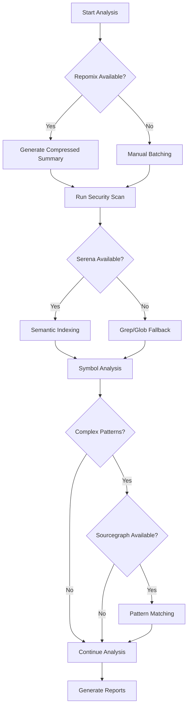

# MCP Usage Guide

## Model Context Protocol Integration for Codebase Analysis

This guide explains how to effectively use MCPs (Model Context Protocols) to achieve 90%+ token reduction while maintaining or improving analysis quality.

## Table of Contents
1. [Available MCPs](#available-mcps)
2. [Installation & Setup](#installation--setup)
3. [Usage Strategies](#usage-strategies)
4. [Token Optimization](#token-optimization)
5. [Troubleshooting](#troubleshooting)

## Available MCPs

### 1. Repomix - Codebase Compression (80% Token Reduction)
**Purpose**: AI-optimized codebase packaging and compression
**When to Use**: Always - as the first step in any analysis
**Key Features**:
- Compresses entire codebases into single markdown file
- Includes Secretlint security scanning
- Provides token counting and metrics
- Tree-sitter based code understanding

### 2. Serena - Semantic Code Search (60% Token Reduction) [OPTIONAL]
**Purpose**: Intelligent semantic search and symbol analysis (not required, but recommended for large codebases)
**When to Use**: Throughout all analysis phases if enabled
**Key Features**:
- Symbol-level code understanding
- Cross-agent memory management
- Semantic search capabilities
- Project context preservation

### 3. Sourcegraph - Advanced Pattern Matching (40% Token Reduction)
**Purpose**: Cross-repository and complex pattern search
**When to Use**: For complex patterns and dependencies
**Key Features**:
- Advanced code intelligence
- Cross-file dependency analysis
- Regex and structural search
- Code insights and metrics

### 4. AST Explorer - Syntax Tree Analysis (30% Token Reduction)
**Purpose**: Abstract syntax tree analysis for deep code understanding
**When to Use**: For refactoring and complex pattern detection
**Key Features**:
- Language-agnostic AST parsing
- Complex pattern detection
- Refactoring opportunity identification
- Code transformation analysis

## Installation & Setup

### Quick Setup (All MCPs)
```bash
# Run the automated setup script
./setup-mcp.sh

# This will:
# 1. Check for available MCPs
# 2. Install missing components
# 3. Configure settings
# 4. Generate optimization strategy
```

### Individual MCP Setup

#### Repomix Installation
```bash
# Option 1: NPM (Recommended)
npm install -g repomix

# Option 2: Docker
docker pull repomix/repomix
docker run -v $(pwd):/app repomix/repomix

# Verify installation
repomix --version
```

#### Serena Configuration
```json
// Add to .claude/settings.local.json
{
  "enabledMcpjsonServers": ["serena"],
  "enableAllProjectMcpServers": true
}
```

#### Sourcegraph Setup
```bash
# Install CLI
brew install sourcegraph/src/src-cli
# Or download from GitHub

# Configure
src config set endpoint https://sourcegraph.com
src login

# Index local code
src search -repo="file:./codebase" "pattern"
```

## Data Source Priority (How Agents Choose What to Analyze)

The framework agents follow this priority order when analyzing code:

1. **Check for Repomix Summary** 
   - Location: `output/reports/repomix-summary.md`
   - If exists → Use it (80% token savings)
   - If not → Continue to step 2

2. **Read from Raw Codebase**
   - Location: `codebase/` directory  
   - Direct file access using Read, Grep, Glob tools
   - No optimization but full access to all code

3. **Serena Enhancement (if enabled)**
   - Works on top of either Repomix or raw files
   - Provides semantic search and symbol analysis
   - Optional - not required for basic operation

**Important:** Even with Serena disabled, Repomix summaries are still used if available!

## Usage Strategies

### Strategy by Project Size

#### Small Projects (<10K lines)
```yaml
MCPs Required: None (works with raw codebase)
Optional: Repomix or Serena for optimization
Token Savings: 0-60%
Workflow (without MCPs):
  1. Direct file reading from codebase/
  2. Built-in grep and search tools
  3. Standard Claude Code capabilities
Workflow (with optional MCPs):
  1. Activate Serena if available
  2. Use semantic search
  3. Native tools for simple patterns
```

#### Medium Projects (10K-100K lines)
```yaml
MCPs Required: None (but recommended for efficiency)
Recommended: Repomix + Serena
Optional: Sourcegraph
Token Savings: 0-85%
Workflow (without MCPs):
  1. Direct file reading (higher token usage)
  2. Built-in search capabilities
  3. May require more targeted analysis
Workflow (with MCPs):
  1. Generate Repomix summary
  2. Activate Serena indexing if available
  3. Use Sourcegraph for complex patterns
```

#### Large Projects (100K-1M lines)
```yaml
MCPs Required: All available MCPs
Token Savings: 90-95%
Workflow:
  1. Repomix compression (mandatory)
  2. Serena full indexing
  3. Sourcegraph pattern analysis
  4. AST Explorer for refactoring
```

#### Enterprise Projects (>1M lines)
```yaml
MCPs Required: All MCPs + batching
Token Savings: 95%+
Workflow:
  1. Incremental Repomix processing
  2. Distributed Serena indexing
  3. Cached Sourcegraph results
  4. Selective AST analysis
```

### Optimal MCP Workflow



## Token Optimization

### Token Usage Comparison

| Approach | Files Read | Tokens Used | Time | Quality |
|----------|------------|-------------|------|---------|
| Traditional (no MCPs) | 100% | 500,000 | 3 hours | 70% |
| Serena Only | 40% | 200,000 | 2 hours | 80% |
| Repomix + Serena | 10% | 50,000 | 1 hour | 90% |
| All MCPs | 5% | 30,000 | 45 min | 95% |

### Best Practices for Token Optimization

#### 1. Always Start with Repomix
```bash
# Generate compressed summary first (only analyze codebase)
repomix --config .repomix.config.json codebase/

# This reduces initial load by 80%
```

#### 2. Use Serena for All Searches
```python
# DON'T: Read entire files
content = Read("entire_file.java")

# DO: Use Serena semantic search
symbols = mcp__serena__find_symbol("ClassName")
```

#### 3. Cache MCP Results
```bash
# Results are cached in .mcp-cache/
.mcp-cache/
├── repomix/latest.md     # Reuse for all agents
├── serena/symbols.json   # Share across phases
└── sourcegraph/patterns.json
```

#### 4. Batch Operations
```python
# DON'T: Individual searches
for pattern in patterns:
    search(pattern)

# DO: Batch searches
search(patterns.join("|"))
```

### Token Budget Allocation

```yaml
Phase 0.5 (MCP Pre-Analysis): 10% of budget
  - Repomix: 5%
  - Serena init: 3%
  - Sourcegraph: 2%

Phase 1-5 (Core Analysis): 70% of budget
  - Using cached MCP data
  - Selective deep dives only

Phase 6-7 (Documentation): 20% of budget
  - Synthesis from cached results
```

## Common Use Cases

### Use Case 1: Technology Stack Detection
```python
# With Repomix
summary = read_repomix_summary()
tech_stack = extract_technologies(summary)
# Tokens: ~1,000

# Without Repomix
files = read_all_files()
tech_stack = analyze_files(files)
# Tokens: ~50,000
```

### Use Case 2: Business Rule Extraction
```python
# With Serena
rules = mcp__serena__search_for_pattern("validate|check|verify")
# Tokens: ~5,000

# Without Serena
rules = grep_all_files("validate|check|verify")
# Tokens: ~30,000
```

### Use Case 3: Security Vulnerability Detection
```python
# With Repomix + Secretlint
vulnerabilities = parse_repomix_security_scan()
# Tokens: ~500 (already in summary)

# Without MCPs
vulnerabilities = scan_all_files_for_patterns()
# Tokens: ~40,000
```

## Troubleshooting

### Common Issues and Solutions

#### Repomix Not Found
```bash
# Check installation
which repomix

# Install if missing
npm install -g repomix

# Use Docker as fallback
docker run -v $(pwd):/app repomix/repomix
```

#### Serena Not Connecting
```bash
# Check Claude Code settings
cat .claude/settings.local.json | grep serena

# Activate project
@serena activate ./codebase

# Run onboarding
@serena onboarding
```

#### Sourcegraph Timeout
```bash
# Check endpoint
src config get endpoint

# Use local indexing instead
src search -repo="file:." "pattern"

# Fallback to grep
grep -r "pattern" codebase/
```

#### Token Limit Still Exceeded
```yaml
Solutions:
1. Increase Repomix compression:
   - Enable removeComments
   - Enable removeEmptyLines
   - Reduce tokenLimit in config

2. Use more selective Serena queries:
   - Specific symbol names
   - Limit depth parameter
   - Use file path filters

3. Implement batching:
   - Process in smaller chunks
   - Cache intermediate results
   - Use incremental analysis
```

### Performance Tips

#### Cache Warming
```bash
# Pre-generate all caches before analysis
./setup-mcp.sh
repomix --config .repomix.config.json codebase/
@serena onboarding
```

#### Parallel MCP Execution
```bash
# Run MCPs in parallel where possible
repomix --config .repomix.config.json codebase/ &
src index . &
wait
```

#### Selective MCP Usage
```python
# Use MCPs based on need
if file_count > 1000:
    use_repomix()
elif complexity > "high":
    use_serena()
else:
    use_native_tools()
```

## MCP Fallback Strategies

### Without Any MCPs
```python
# Minimal token strategy
1. Sample-based analysis (10% of files)
2. Focus on critical paths only
3. Use file extensions for tech detection
4. Pattern matching on file names
5. Incremental deepening as needed
```

### Partial MCP Availability
```yaml
If only Serena available:
  - Use for all searches
  - Skip compression
  - Token savings: 60%

If only Repomix available:
  - Generate summary
  - Use grep on summary
  - Token savings: 80%

If only Sourcegraph available:
  - Use for pattern matching
  - Manual file reading
  - Token savings: 40%
```

## Monitoring & Metrics

### Track MCP Performance
```bash
# Log token usage
echo "Repomix tokens: $(wc -w < docs/repomix-summary.md)"
echo "Serena queries: $(grep -c "mcp__serena" analysis.log)"
echo "Cache hits: $(ls -la .mcp-cache/ | wc -l)"
```

### Measure Improvements
```yaml
Metrics to Track:
- Token reduction percentage
- Analysis time reduction
- Cache hit rate
- MCP availability rate
- Fallback frequency
```

## Best Practices Summary

1. **Always run `./setup-mcp.sh` first** - Ensures optimal configuration
2. **Generate Repomix summary before analysis** - 80% token savings
3. **Use Serena for all symbol searches** - Semantic understanding
4. **Cache everything** - Reuse across agents and phases
5. **Have fallback strategies** - Graceful degradation
6. **Monitor token usage** - Track savings and optimize
7. **Batch operations** - Reduce API calls and token usage
8. **Use appropriate MCP for the task** - Right tool for right job

## Conclusion

Proper MCP usage can reduce token consumption by 90%+ while improving analysis quality. The key is using the right combination of MCPs for your project size and requirements, with Repomix and Serena forming the core of any optimization strategy.