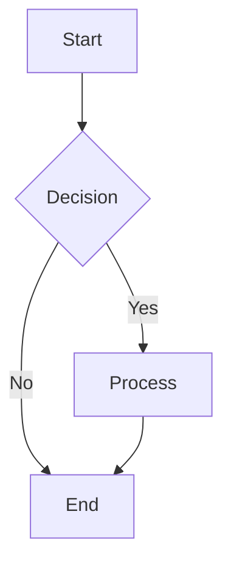
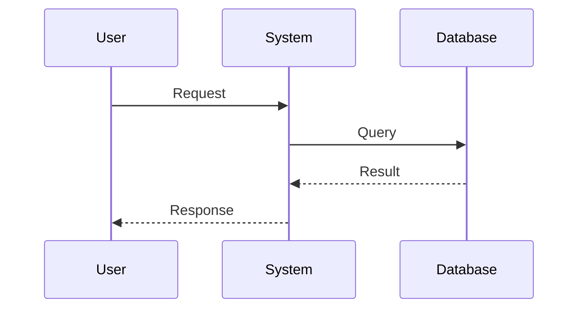
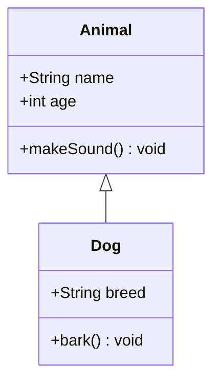
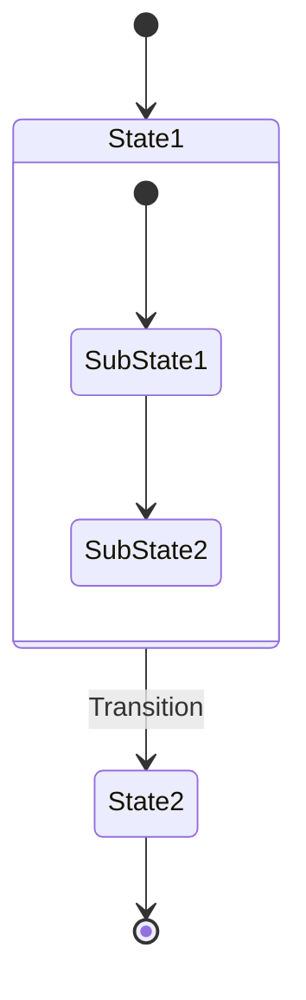
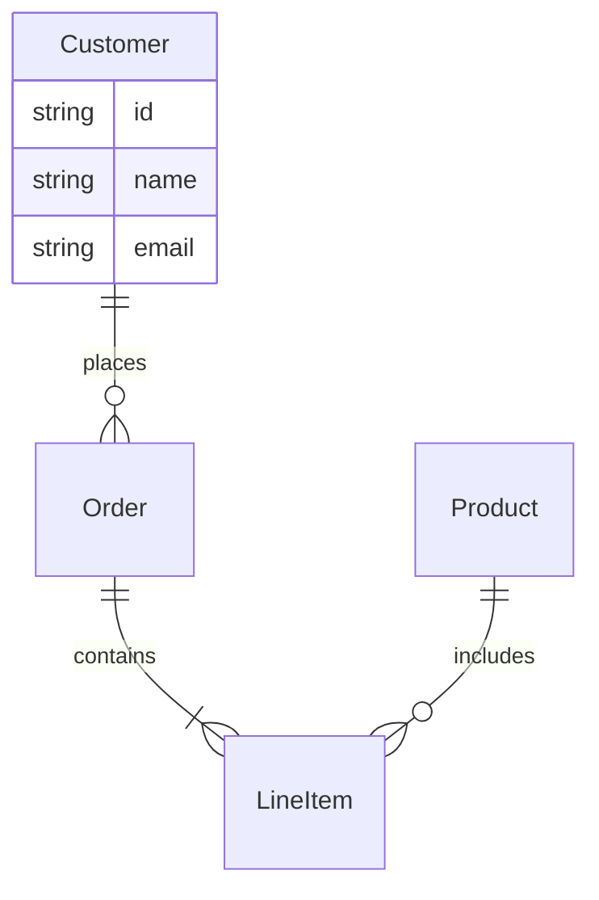
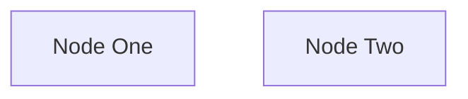
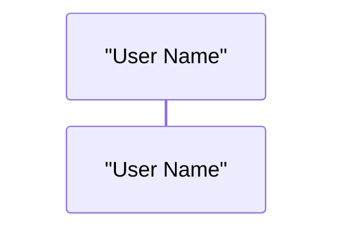
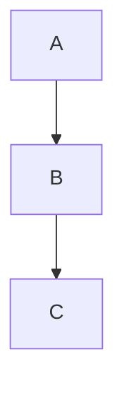

# Mermaid Diagram Generation Guide for Agents

## CRITICAL: ALL AGENTS MUST USE THE PRE-WRITE HOOK

**MANDATORY**: Before writing ANY Mermaid content to files, you MUST process it through the validation system:

```python
# For Python-based agents
from framework.scripts.mermaid_pre_write_hook import ensure_valid_mermaid

# ALWAYS do this before Write()
content = ensure_valid_mermaid(content, file_path)
Write(file_path, content)
```

## Common Mermaid Diagram Types and Valid Syntax

### 1. Flowchart/Graph Diagrams



**Rules:**
- Always start with `graph` or `flowchart` followed by direction (TB, TD, LR, RL, BT)
- Node IDs CANNOT start with numbers (use N1, not 1)
- Use subgraph for grouping, not state
- End each subgraph with `end`

### 2. Sequence Diagrams



**Rules:**
- Start with `sequenceDiagram`
- Declare participants first
- Participant names with spaces need quotes: `participant "User Name"`
- No duplicate participant declarations

### 3. Class Diagrams



**Rules:**
- Start with `classDiagram`
- Use `class` keyword for each class
- Methods and attributes use +, -, # for visibility

### 4. State Diagrams



**Rules:**
- Use `stateDiagram-v2` (not just `stateDiagram`)
- Use `state` for grouping, not `subgraph`
- [*] represents start/end states
- Cannot mix with graph syntax

### 5. Entity Relationship Diagrams



**Rules:**
- Start with `erDiagram`
- Use proper relationship symbols: ||--||, ||--o{, }o--||, etc.
- Define entities and their attributes

## Common Errors and How to Avoid Them

### ❌ NEVER DO THIS:

1. **Duplicate type declarations:**
```mermaid
graph TB
graph TB  %% ERROR: Duplicate!
```

2. **Numeric node IDs:**
```mermaid
graph TB
    1[Node One]  %% ERROR: Starts with number
    2[Node Two]  %% ERROR: Starts with number
```

3. **Mixed syntax:**
```mermaid
stateDiagram-v2
    subgraph "Wrong"  %% ERROR: Use 'state' not 'subgraph'
```

4. **Unclosed quotes:**
```mermaid
sequenceDiagram
    participant "User Name  %% ERROR: Missing closing quote
```

5. **Trailing arrows:**
```mermaid
graph TB
    A --> B
    B -->  %% ERROR: Arrow points to nothing
```

### ✅ ALWAYS DO THIS:

1. **Single type declaration at the top:**
```mermaid
graph TB
    %% Rest of diagram
```

2. **Prefix numeric IDs:**


3. **Use correct grouping syntax:**
```mermaid
stateDiagram-v2
    state "Group Name" {
        %% States here
    }
```

4. **Quote names with spaces:**


5. **Complete all arrows:**


## Validation Checklist for Agents

Before generating any Mermaid diagram:

1. ✅ **Determine the correct diagram type** based on content
2. ✅ **Add the diagram type as the first line**
3. ✅ **Ensure no duplicate type declarations**
4. ✅ **Prefix any numeric node IDs with 'N'**
5. ✅ **Quote participant/node names with spaces**
6. ✅ **Balance all subgraphs/states with 'end'**
7. ✅ **Ensure all arrows point to valid targets**
8. ✅ **Use the correct syntax for the diagram type**
9. ✅ **Process through ensure_valid_mermaid() before writing**

## Integration in Agent Code

### Example Agent Implementation:

```python
def generate_architecture_diagram(components):
    """Generate a system architecture diagram"""
    
    # Build the diagram content
    diagram = "graph TB\n"
    
    for i, component in enumerate(components):
        # Use N prefix for numeric IDs
        node_id = f"N{i}"
        # Escape special characters in labels
        label = component.name.replace('"', '\\"')
        diagram += f'    {node_id}["{label}"]\n'
    
    # Add connections
    for connection in get_connections(components):
        diagram += f"    {connection.from_id} --> {connection.to_id}\n"
    
    # CRITICAL: Validate and fix before writing
    from framework.scripts.mermaid_pre_write_hook import ensure_valid_mermaid
    
    fixed_diagram = ensure_valid_mermaid(diagram, "architecture.mmd")
    
    # Now safe to write
    Write("output/diagrams/architecture.mmd", fixed_diagram)
```

## Testing Diagrams

Always test your generated diagrams:

1. Use the comprehensive validator:
```bash
python3 framework/scripts/comprehensive_mermaid_validator.py output/diagrams/
```

2. Test rendering at: https://mermaid.live

3. Check for common issues:
   - Diagram displays correctly
   - All nodes are visible
   - All connections are shown
   - No syntax errors reported

## Emergency Fallback

If a diagram cannot be fixed, the system will create a minimal valid fallback. This ensures:
- No broken diagrams are written
- User gets some visualization even if original failed
- Error is logged for debugging

## Support and Troubleshooting

- Validation script: `framework/scripts/comprehensive_mermaid_validator.py`
- Pre-write hook: `framework/scripts/mermaid_pre_write_hook.py`
- Test directory: `output/diagrams/`
- Documentation: This file

Remember: **ALWAYS USE ensure_valid_mermaid() BEFORE WRITING ANY MERMAID CONTENT!**