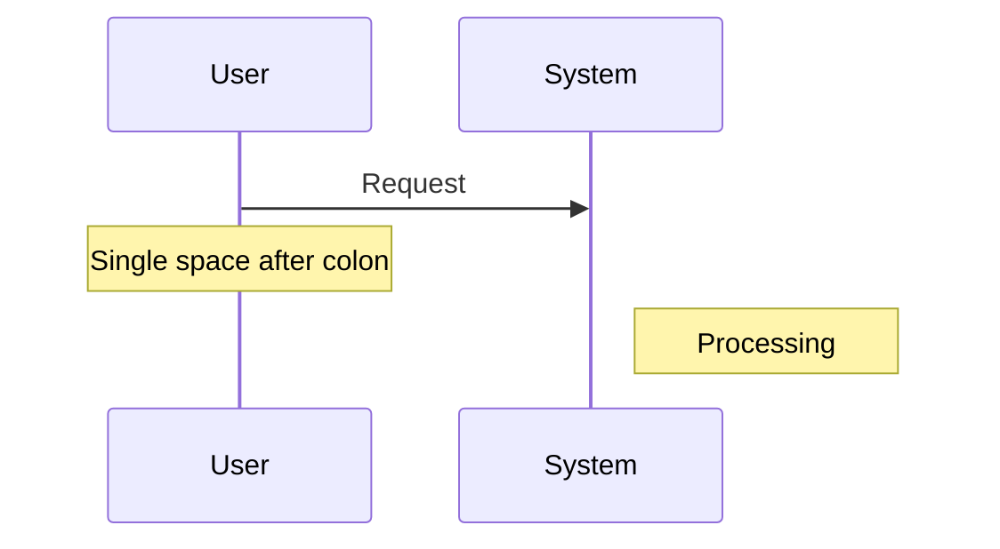
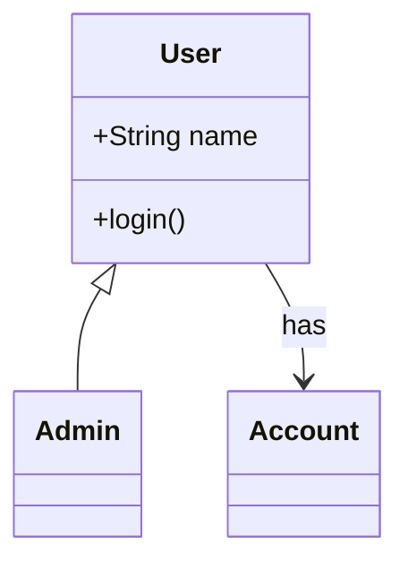
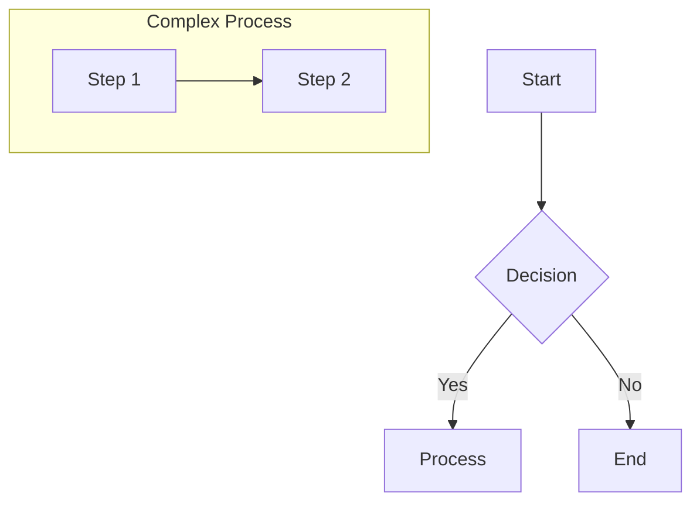
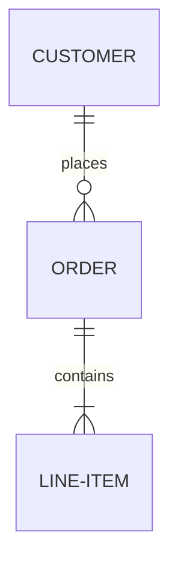
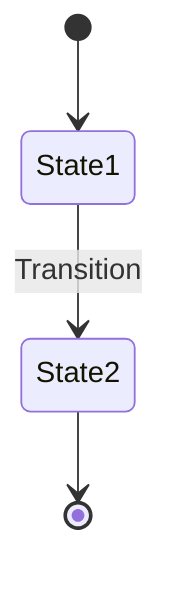

# Mermaid Diagram Complete Guide

## Overview
Comprehensive guide for generating, validating, and fixing Mermaid diagrams in the framework.

## Core Philosophy: Prevention → Validation → Fix

### 1. **PREVENT** - Follow strict rules when generating
### 2. **VALIDATE** - Check before and after writing
### 3. **FIX** - Apply intelligent fixes based on errors
### 4. **VERIFY** - Confirm in browser viewer

---

## Part 1: Strict Generation Rules

### Universal Formatting Rules
```
✅ ALWAYS:
- Start file with diagram type declaration
- End file with exactly one newline
- Use spaces, never tabs
- Keep lines under 200 characters
- No trailing whitespace on any line
- Comments MUST start at column 1 (no indentation)

❌ NEVER:
- Use tabs anywhere
- Have more than 2 consecutive blank lines
- Indent comments with spaces or tabs
- Use numeric-only node IDs (e.g., "1", "2")
```

### Special Character Rules
```
✅ SAFE in labels (unquoted):
- Letters (a-z, A-Z)
- Numbers (0-9)
- Spaces
- Basic punctuation: . , ! ?

✅ REQUIRES QUOTES:
- Parentheses: ( )
- Brackets: [ ] { }
- Special: & $ # @ % ^ * = + | \ / < >
- Colons: :
- Semicolons: ;

✅ CORRECT:
graph TD
    A[Simple Label]
    B["Label with (parentheses)"]
    C["getMethod()"]
    D["Price: $100"]

❌ WRONG:
graph TD
    A[Label with (parens)]  %% Unquoted parens
    B[getMethod()]          %% Unquoted parens
    C[Price: $100]          %% Unquoted special chars
```

### Diagram-Specific Rules

#### Sequence Diagrams


#### Class Diagrams

Note: No @ symbols in stereotypes, relationship labels need colons

#### Flowcharts/Graphs


#### ER Diagrams


#### State Diagrams

Note: Always use `stateDiagram-v2`, not `stateDiagram`

---

## Part 2: Validation System

### Three-Layer Validation Approach

#### Layer 1: Pre-Write Validation
- **Script:** `.claude/hooks/simple_mermaid_validation.py`
- **Purpose:** Validate before writing to disk
- **Auto-fixes:** Basic formatting, spacing, comment indentation

#### Layer 2: Smart Validation & Fixing
- **Script:** `framework/scripts/smart_mermaid_validator.py`
- **Purpose:** Intelligent error-based fixing
- **Features:**
  - Parses Mermaid CLI error messages
  - Applies targeted fixes based on specific errors
  - Iterative fixing (up to 5 attempts)
  - Handles both `.md` and `.mmd` files

#### Layer 3: Browser Verification
- **Tool:** `framework/document-viewer.html`
- **Purpose:** Final visual verification
- **Usage:** Open in browser, load directory, view all diagrams

### Common Errors and Fixes

| Error Message | Cause | Automatic Fix |
|--------------|-------|---------------|
| "Expecting 'SQE', got 'PS'" | Unquoted parentheses | Quotes added around labels with () |
| "Expecting COLON" | Missing colon in relationship | Adds `: ` before label |
| "Parse error on line X" | Unbalanced brackets | Checks and reports issue |
| "Invalid syntax" | Wrong diagram type | Converts to correct type |
| "Duplicate id" | Repeated node IDs | Renames duplicates |

---

## Part 3: Usage Instructions

### For Agents Generating Diagrams

```python
# 1. Import the validator
from framework.scripts.smart_mermaid_validator import MermaidValidator

# 2. Create validator instance
validator = MermaidValidator()

# 3. Generate your diagram following strict rules
diagram_content = """
graph TD
    A["Start Process"]
    B["Check Input()"]
    C[End]
    A --> B : validate
    B --> C : complete
"""

# 4. Validate and fix
fixed_content, is_valid, errors = validator.validate_and_fix(diagram_content)

# 5. Only write if valid
if is_valid:
    write_to_file(fixed_content)
else:
    handle_errors(errors)
```

### Command Line Usage

```bash
# Validate all diagrams
python3 framework/scripts/smart_mermaid_validator.py output/

# Validate and auto-fix
python3 framework/scripts/smart_mermaid_validator.py output/ --fix

# Validate single file
python3 framework/scripts/smart_mermaid_validator.py output/diagrams/example.mmd --fix

# Get JSON report
python3 framework/scripts/smart_mermaid_validator.py output/ --json
```

### Testing in Browser

1. Open `framework/document-viewer.html` in a browser
2. Click "Open Directory" and select your output folder
3. Navigate through files in the sidebar
4. View rendered diagrams in the preview pane
5. Any rendering errors will be displayed

---

## Part 4: Project-Specific Policies

### No Timelines Policy
**IMPORTANT:** All diagrams MUST avoid specific dates and timelines.

```
✅ GOOD:
- "Phase 1", "Phase 2", "Phase 3"
- "Short-term", "Medium-term", "Long-term"
- "Initial", "Intermediate", "Final"

❌ BAD:
- "Q1 2024", "March 2024"
- "3 months", "6 weeks"
- Specific dates or durations
```

### Visual Indicators for Issues
Use consistent visual indicators in diagrams:

```mermaid
classDef critical fill:#ff6b6b,stroke:#c92a2a,stroke-width:3px
classDef warning fill:#ffd93d,stroke:#fab005,stroke-width:2px
classDef success fill:#51cf66,stroke:#37b24d,stroke-width:2px
classDef info fill:#74c0fc,stroke:#339af0,stroke-width:2px
```

---

## Part 5: File Structure

### Validation Scripts
```
framework/scripts/
├── smart_mermaid_validator.py    # Main validator with error-based fixing
└── simple_mermaid_validator.py   # Simple validator (backup)

.claude/hooks/
└── simple_mermaid_validation.py  # Pre-write hook

framework/
└── document-viewer.html          # Browser-based viewer/validator
```

### Documentation
```
framework/docs/
├── MERMAID_COMPLETE_GUIDE.md     # This comprehensive guide
└── MERMAID_STRICT_RULES.md       # Quick reference rules
```

---

## Part 6: Troubleshooting

### If Diagrams Don't Render

1. **Check with validator:**
   ```bash
   python3 framework/scripts/smart_mermaid_validator.py <file> --fix
   ```

2. **Review error message:**
   - Look for line number
   - Check for unquoted special characters
   - Verify balanced brackets

3. **Test in browser:**
   - Open document-viewer.html
   - Load the file
   - Check console for errors

4. **Manual fixes if needed:**
   - Quote all labels with special characters
   - Ensure all subgraphs have 'end' statements
   - Check relationship syntax matches diagram type
   - Verify diagram type declaration is correct

### Performance Tips

- Run validation on entire directories at once
- Use `--fix` flag to auto-correct common issues
- Test in browser for final verification
- Keep diagrams under 500 nodes for best performance

---

## Summary

The Mermaid validation system ensures high-quality, error-free diagrams through:

1. **Strict generation rules** that prevent errors
2. **Smart validation** that fixes issues automatically
3. **Browser verification** for final confirmation
4. **Clear documentation** for troubleshooting

Follow the rules, use the validators, and test in the browser for perfect diagrams every time.