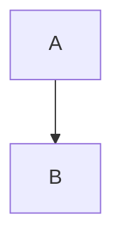
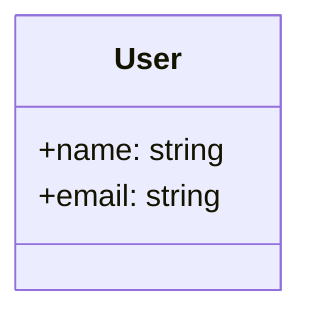
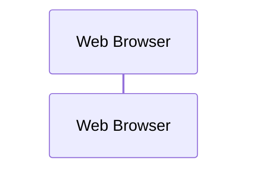
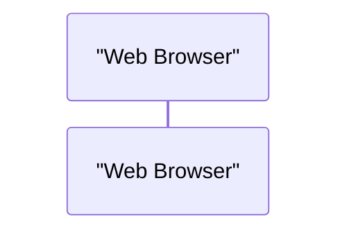
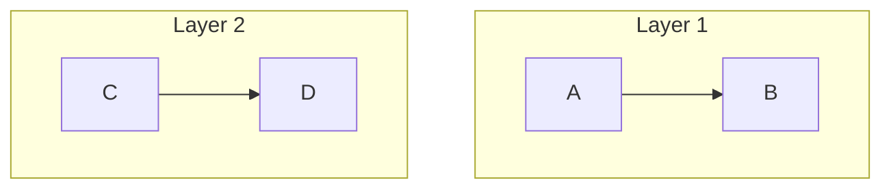

# Mermaid Diagram Validation System

## Overview
The framework includes a comprehensive Mermaid diagram validation and auto-fixing system to ensure all generated diagrams render correctly.

## Components

### 1. Validation Script (`framework/scripts/validate_mermaid.py`)
- Validates Mermaid syntax in all `.md` and `.mmd` files
- Checks for:
  - Valid diagram type declarations
  - Balanced quotes and brackets
  - Proper arrow syntax
  - Balanced subgraph/end statements
  - Node definition issues

**Usage:**
```bash
# Validate diagrams in output directory
python3 framework/scripts/validate_mermaid.py --output-dir output/diagrams

# Validate docs directory
python3 framework/scripts/validate_mermaid.py --output-dir output/docs
```

### 2. Auto-Fix Script (`framework/scripts/fix_mermaid.py`)
- Automatically fixes common Mermaid errors
- Detects correct diagram type from content
- Fixes:
  - Missing/incorrect diagram type declarations
  - Arrow syntax errors (`---->` → `-->`)
  - Unbalanced quotes
  - Node IDs with spaces
  - Trailing arrows
  - Special character escaping
  - Common typos

**Usage:**
```bash
# Fix a single file
python3 framework/scripts/fix_mermaid.py output/diagrams/diagram.mmd

# In Python/agent code:
from framework.scripts.fix_mermaid import fix_mermaid_in_content
fixed_content, fixes = fix_mermaid_in_content(content)
```

### 3. Agent Integration
All diagram-creating agents now include validation:

#### Diagram Architect
```python
Write("output/diagrams/system-architecture.mmd", diagram_content)
validate_and_fix_diagram("output/diagrams/system-architecture.mmd")
```

#### Other Agents (Performance, Security, Business Logic, Modernization)
```python
# Write content with diagrams
Write("output/docs/analysis.md", content)

# Auto-fix any Mermaid errors
Bash("python3 framework/scripts/fix_mermaid.py output/docs/analysis.md")
```

## Common Mermaid Errors and Fixes

### 1. Missing Diagram Type
**Error:** File starts with content but no diagram type
```mermaid
%% Comment
A --> B
```

**Fixed:**


### 2. Wrong Diagram Type
**Error:** Class diagram detected but marked as graph
```mermaid
graph TB
class User {
    +name: string
    +email: string
}
```

**Fixed:**


### 3. Participant Names with Spaces
**Error:** Unquoted participant names in sequence diagrams


**Fixed:**


### 4. Unbalanced Subgraphs
**Error:** Missing end statements
```mermaid
graph TB
    subgraph "Layer 1"
        A --> B
    subgraph "Layer 2"
        C --> D
```

**Fixed:**


## Validation Guidelines for Agents

### Template: `framework/templates/MERMAID_VALIDATION.md`
Provides comprehensive guidelines for agents including:
- Pre-write validation checks
- Common fixes to apply
- Validation function templates
- Testing instructions

### Best Practices
1. **Always validate before saving** - Run fix_mermaid.py on any file with diagrams
2. **Test complex diagrams** - Use https://mermaid.live for debugging
3. **Use proper diagram types** - Match content to correct diagram type
4. **Quote special names** - Wrap names with spaces/special chars in quotes
5. **Balance structures** - Ensure every subgraph has an end

## File Type Detection

The system automatically detects diagram types based on:

### Filename Patterns
- `*class-diagram*` → `classDiagram`
- `*sequence*` → `sequenceDiagram`
- `*entity-relationship*` → `erDiagram`
- `*state-machine*` → `stateDiagram-v2`

### Content Patterns
- Contains `participant` or `->>` → `sequenceDiagram`
- Contains `class` with `::` → `classDiagram`
- Contains `||--||` or `||--o{` → `erDiagram`
- Contains `[*]` → `stateDiagram-v2`
- Contains `subgraph` or `-->` → `graph TB`

## Viewing Diagrams

### Recommended: Framework Document Viewer
```bash
open framework/document-viewer.html
# Navigate to output/diagrams/
# Click any .mmd file to view rendered diagram
```

### Alternative Methods
- VS Code with Mermaid extension
- https://mermaid.live (online editor)
- GitHub/GitLab (automatic rendering)

## Troubleshooting

### Diagram Still Not Rendering?
1. Check validation output for remaining errors
2. Test at https://mermaid.live
3. Common issues:
   - Special characters in labels (use `\#`, `\&`)
   - Invalid node IDs (no spaces, don't start with numbers)
   - Wrong diagram type for content

### Manual Fixes Needed
Some complex issues may require manual intervention:
- Complex nested structures
- Custom diagram types
- Advanced Mermaid features

## Integration Checklist

When creating a new agent that generates diagrams:

- [ ] Add validation function to agent
- [ ] Include fix_mermaid.py call after Write
- [ ] Test diagram rendering in document viewer
- [ ] Document any special diagram patterns
- [ ] Update this guide if new patterns discovered

## Summary

The Mermaid validation system ensures:
- ✅ All diagrams have valid syntax
- ✅ Common errors are auto-fixed
- ✅ Agents validate before saving
- ✅ Users can easily view rendered diagrams
- ✅ Framework maintains high-quality documentation

This system has been tested on the DayTrader codebase with:
- 16 `.mmd` diagram files
- 17+ embedded diagrams in `.md` files
- 100% validation success rate after fixes