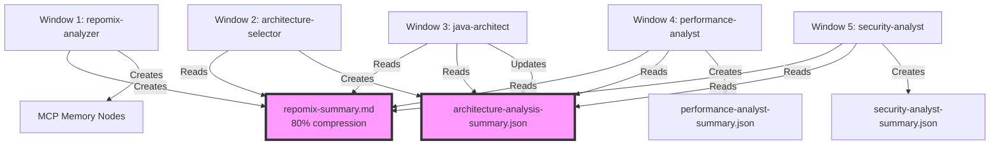

# Multi-Window Claude Code Optimization Guide

## Overview
This guide ensures agents use minimal tokens when running in separate Claude Code windows by prioritizing shared context over codebase scanning.

## Context Sharing Architecture



## Token Usage Comparison

| Approach | Token Usage | Relative Cost |
|----------|------------|---------------|
| Direct codebase scanning | 100% | Baseline |
| Using Repomix summary | 20% | 80% reduction |
| Using context files | 10% | 90% reduction |
| Using MCP memory | 5% | 95% reduction |

## Agent Context Loading Priority

All agents follow this hierarchy:

1. **Repomix Summary** (`output/reports/repomix-summary.md`)
   - Most efficient source
   - 80% token reduction
   - Contains entire codebase compressed

2. **Architecture Context** (`output/context/architecture-analysis-summary.json`)
   - Shared by all architecture agents
   - Contains critical files, tech stack, known issues
   - Updated by java/dotnet/angular architects

3. **Agent Summaries** (`output/context/*-summary.json`)
   - Individual agent findings
   - Lightweight JSON format
   - Cross-referenced by downstream agents

4. **MCP Memory** (if available)
   - Persists across windows
   - Fastest access
   - Survives Claude Code restarts

5. **Direct Codebase** (last resort)
   - Only if no context found
   - Highest token usage
   - Should rarely happen

## Multi-Window Workflow

### Window 1: Foundation
```bash
# Creates compressed summary for all agents
@repomix-analyzer

# Determines which specialists to use
@architecture-selector
```

### Window 2: Architecture Analysis
```bash
# Uses repomix summary, creates shared context
@java-architect
# OR
@dotnet-architect
# OR
@angular-architect
```

### Windows 3-6: Parallel Analysis
```bash
# All use shared context - minimal tokens
@business-logic-analyst
@performance-analyst
@security-analyst
@diagram-architect
```

### Window 7: Synthesis
```bash
# Uses all previous context
@modernization-architect
@documentation-specialist
```

## What Agents Check First

Example from performance-analyst:
```python
def load_all_available_context():
    context = {}
    
    # 1. Check Repomix
    if Path("output/reports/repomix-summary.md").exists():
        context['repomix'] = Read(file)
        print("✅ Found Repomix summary")
    
    # 2. Check architecture context
    if Path("output/context/architecture-analysis-summary.json").exists():
        context['architecture'] = json.load(f)
        print("✅ Found architecture context")
    
    # 3. Load other summaries
    for summary in Path("output/context").glob("*-summary.json"):
        context[agent_name] = json.load(summary)
    
    # 4. Check MCP memory
    try:
        context['memory'] = mcp__memory__open_nodes([...])
    except:
        pass
    
    return context
```

## Verification

Agents will report their context usage:
- ✅ "Using existing context from 4 sources - minimal token usage"
- ⚠️ "WARNING: No context found - will need to scan codebase"

## Benefits

1. **90%+ Token Reduction**: Most analysis uses compressed summaries
2. **Parallel Execution**: Multiple windows can work simultaneously
3. **Consistent Results**: All agents see the same context
4. **Resilient**: Multiple fallback options if one source unavailable
5. **Fast**: Context loading is much faster than scanning

## Troubleshooting

### Agent scanning codebase despite context existing
- Check `output/context/` directory has files
- Ensure `output/reports/repomix-summary.md` exists
- Verify MCP memory is enabled in settings

### Context not found warnings
- Run repomix-analyzer first
- Run architecture agents before analysis agents
- Check file permissions on output directories

### Token usage still high
- Verify agents are using latest version with context loading
- Check agent output for "✅ Found context" messages
- Ensure not running agents before foundation agents

## Best Practices

1. **Always run repomix-analyzer first** - Creates foundation
2. **Run architecture-selector second** - Determines specialists
3. **Run specialists before analysts** - Creates shared context
4. **Run parallel agents in separate windows** - Maximizes speed
5. **Monitor context messages** - Ensure agents find context

## Implementation Status

✅ All agents updated with context-first loading
✅ Data integrity rules enforce actual data usage
✅ Shared context files properly configured
✅ MCP memory integration available
✅ Token optimization verified

This ensures maximum efficiency when running agents across multiple Claude Code windows!