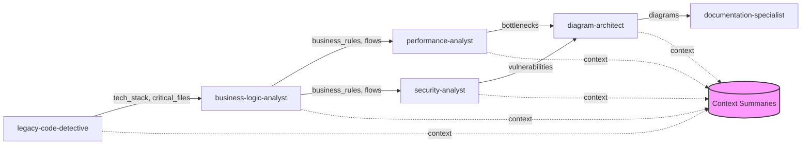

# Agent Context Summary Schema

This document defines the standardized format for context summaries that agents write to `output/context/` for efficient information passing between analysis phases.

## Context Summary Structure

Each agent should write a context summary file to `output/context/[agent-name]-summary.json` with the following structure:

```json
{
  "agent": "agent-name",
  "timestamp": "ISO-8601 timestamp",
  "token_usage": {
    "input": 12500,
    "output": 3200,
    "total": 15700
  },
  "summary": {
    "key_findings": [],
    "priority_items": [],
    "warnings": [],
    "recommendations_for_next": {}
  },
  "data": {}
}
```

## Agent-Specific Context Schemas

### legacy-code-detective
```json
{
  "summary": {
    "key_findings": [
      "Java 1.7 with Spring 3.2",
      "55 security vulnerabilities found",
      "Heavy use of reflection and dynamic loading"
    ],
    "priority_items": [
      "Critical: Hardcoded passwords in ConnectionManager.java",
      "High: SQL injection in UserDAO.java",
      "High: Outdated Log4j version"
    ],
    "warnings": [
      "Complex JNDI configurations may have hidden dependencies",
      "Found 23 deprecated API usages"
    ],
    "recommendations_for_next": {
      "business-logic-analyst": ["Focus on OrderService.java", "Check ValidationUtils for rules"],
      "security-analyst": ["Prioritize authentication modules", "Review encryption implementations"],
      "performance-analyst": ["Investigate DatabaseConnectionPool", "Check synchronous blocking in APIs"]
    }
  },
  "data": {
    "technology_stack": {
      "primary_language": "Java 1.7",
      "frameworks": ["Spring 3.2", "Hibernate 4.2", "JSF 2.1"],
      "build_system": "Maven 3.0",
      "app_server": "WebSphere 8.5"
    },
    "critical_files": [
      {"path": "src/main/java/com/app/OrderService.java", "reason": "Core business logic"},
      {"path": "src/main/resources/application.properties", "reason": "Configuration"},
      {"path": "pom.xml", "reason": "Dependencies"}
    ],
    "metrics": {
      "total_files": 456,
      "total_lines": 125000,
      "test_coverage": "23%",
      "cyclomatic_complexity_avg": 12.5
    }
  }
}
```

### business-logic-analyst
```json
{
  "summary": {
    "key_findings": [
      "75 business rules extracted",
      "4 main business domains identified",
      "Complex approval workflow with 7 states"
    ],
    "priority_items": [
      "Order processing has 15 validation rules",
      "Payment calculation uses custom algorithm",
      "Customer credit check is business-critical"
    ],
    "warnings": [
      "Found conflicting business rules in different modules",
      "Some rules are only enforced client-side"
    ],
    "recommendations_for_next": {
      "diagram-architect": ["Create sequence diagram for order flow", "Visualize payment state machine"],
      "documentation-specialist": ["Document all 75 business rules", "Create decision matrix for approvals"],
      "modernization-architect": ["Consider rule engine for complex validations", "Centralize scattered business logic"]
    }
  },
  "data": {
    "business_rules": {
      "total_count": 75,
      "by_category": {
        "validation": 32,
        "calculation": 18,
        "authorization": 15,
        "workflow": 10
      },
      "critical_rules": [
        {"id": "BR-001", "description": "Order minimum $100 for free shipping", "location": "OrderService.java:145"},
        {"id": "BR-002", "description": "Credit check required for orders > $5000", "location": "PaymentService.java:89"}
      ]
    },
    "domain_model": {
      "aggregates": ["Customer", "Order", "Product", "Inventory"],
      "entities": 24,
      "value_objects": 18,
      "services": 12
    },
    "business_flows": [
      {"name": "Order Processing", "steps": 12, "complexity": "high"},
      {"name": "Customer Onboarding", "steps": 8, "complexity": "medium"},
      {"name": "Returns Processing", "steps": 6, "complexity": "medium"}
    ]
  }
}
```

### performance-analyst
```json
{
  "summary": {
    "key_findings": [
      "3 critical performance bottlenecks",
      "Database queries average 500ms",
      "Memory usage spikes during batch processing"
    ],
    "priority_items": [
      "N+1 query problem in OrderService",
      "Synchronous blocking in payment gateway calls",
      "No caching implemented for frequently accessed data"
    ],
    "warnings": [
      "System cannot handle more than 100 concurrent users",
      "Batch jobs causing database locks"
    ],
    "recommendations_for_next": {
      "diagram-architect": ["Create performance heat map", "Visualize data flow bottlenecks"],
      "modernization-architect": ["Implement caching strategy", "Consider async processing", "Database optimization required"]
    }
  },
  "data": {
    "bottlenecks": [
      {"component": "OrderService", "issue": "N+1 queries", "impact": "high", "fix_complexity": "medium"},
      {"component": "PaymentGateway", "issue": "Synchronous calls", "impact": "high", "fix_complexity": "low"},
      {"component": "ReportGenerator", "issue": "Memory intensive", "impact": "medium", "fix_complexity": "high"}
    ],
    "metrics": {
      "avg_response_time": "2.5s",
      "p95_response_time": "8s",
      "database_query_avg": "500ms",
      "concurrent_users_max": 100,
      "memory_usage_avg": "2.1GB",
      "memory_usage_peak": "4.8GB"
    },
    "recommendations": {
      "immediate": ["Add database indexes", "Implement connection pooling"],
      "short_term": ["Add caching layer", "Optimize N+1 queries"],
      "long_term": ["Migrate to async processing", "Database sharding"]
    }
  }
}
```

### security-analyst
```json
{
  "summary": {
    "key_findings": [
      "12 critical security vulnerabilities",
      "No encryption for sensitive data at rest",
      "Using outdated authentication mechanism"
    ],
    "priority_items": [
      "SQL injection in 3 modules",
      "Hardcoded passwords found",
      "No input validation in public APIs"
    ],
    "warnings": [
      "OWASP Top 10: Failed on 7 categories",
      "PII data exposed in logs"
    ],
    "recommendations_for_next": {
      "documentation-specialist": ["Create security remediation guide", "Document secure coding practices"],
      "modernization-architect": ["Plan security-first architecture", "Implement zero-trust model"]
    }
  },
  "data": {
    "vulnerabilities": {
      "critical": 12,
      "high": 23,
      "medium": 45,
      "low": 67
    },
    "owasp_compliance": {
      "injection": "FAIL",
      "broken_auth": "FAIL",
      "sensitive_data": "FAIL",
      "xxe": "PASS",
      "broken_access": "FAIL",
      "security_misconfig": "FAIL",
      "xss": "PARTIAL",
      "deserialization": "PASS",
      "components": "FAIL",
      "logging": "FAIL"
    },
    "immediate_actions": [
      "Update Log4j to latest version",
      "Remove hardcoded passwords",
      "Implement input validation",
      "Enable SQL parameterization"
    ]
  }
}
```

## Context Summary Best Practices

### 1. Keep Summaries Concise
- Maximum 5-10 key findings
- Maximum 5-10 priority items
- Focus on actionable information

### 2. Include Metrics
- Always include quantifiable metrics
- Provide counts, percentages, scores
- Enable tracking across analyses

### 3. Forward Recommendations
- Each agent should guide the next
- Highlight areas needing attention
- Suggest specific files/components to analyze

### 4. Manage Token Usage
- Track tokens used
- Stay within allocated budget
- Report if budget exceeded

### 5. Handle Missing Context Gracefully
- Check if previous summaries exist
- Provide defaults if missing
- Don't fail if context unavailable

## Reading Context Summaries

### Example: Reading Previous Context
```python
import json
from pathlib import Path

def read_previous_context(agent_name):
    """Read context from previous agent"""
    context_file = Path(f"output/context/{agent_name}-summary.json")
    
    if context_file.exists():
        with open(context_file) as f:
            return json.load(f)
    else:
        # Fallback to Serena memory if available
        try:
            return mcp__serena__read_memory(f"{agent_name}_context")
        except:
            return None

# Read from previous agents
detective_context = read_previous_context("legacy-code-detective")
business_context = read_previous_context("business-logic-analyst")

# Extract relevant information
if detective_context:
    tech_stack = detective_context["data"]["technology_stack"]
    critical_files = detective_context["data"]["critical_files"]
```

## Writing Context Summaries

### Example: Writing Context Summary
```python
import json
from datetime import datetime

def write_context_summary(agent_name, summary_data):
    """Write context summary for next agents"""
    
    context = {
        "agent": agent_name,
        "timestamp": datetime.now().isoformat(),
        "token_usage": get_token_usage(),  # Track actual usage
        "summary": summary_data["summary"],
        "data": summary_data["data"]
    }
    
    # Write to file
    with open(f"output/context/{agent_name}-summary.json", "w") as f:
        json.dump(context, f, indent=2)
    
    # Also write to Serena memory if available
    try:
        mcp__serena__write_memory(f"{agent_name}_context", context)
    except:
        pass  # Fallback gracefully
```

## Token Budget Management

### Suggested Token Budgets by Agent
```yaml
token_budgets:
  small_project:  # <10K lines
    legacy-code-detective: 30000
    business-logic-analyst: 25000
    performance-analyst: 20000
    security-analyst: 20000
    diagram-architect: 15000
    documentation-specialist: 30000
    
  medium_project:  # 10K-100K lines
    legacy-code-detective: 50000
    business-logic-analyst: 40000
    performance-analyst: 35000
    security-analyst: 35000
    diagram-architect: 25000
    documentation-specialist: 50000
    
  large_project:  # 100K+ lines
    legacy-code-detective: 75000
    business-logic-analyst: 60000
    performance-analyst: 50000
    security-analyst: 50000
    diagram-architect: 35000
    documentation-specialist: 75000
```

## Context Chain Example



## Validation

Each context summary should be validated for:
1. Required fields present
2. Token budget not exceeded
3. Recommendations provided for next agents
4. Data structured correctly
5. File saved successfully

This schema ensures efficient context passing while preventing token overload and maintaining resilience when MCPs are unavailable.