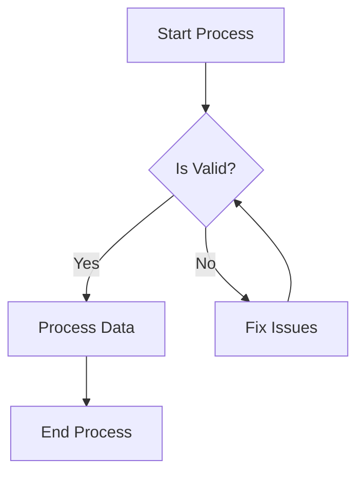

# Mermaid Diagram Validation Instructions

## CRITICAL: Always Validate Mermaid Diagrams

**Every agent that creates Mermaid diagrams MUST follow these steps:**

### 1. Before Writing Any Diagram
Ensure your diagram:
- Starts with a valid type (`graph TB`, `sequenceDiagram`, `classDiagram`, etc.)
- Has balanced quotes and brackets
- Uses valid node IDs (no spaces, don't start with numbers)
- Has balanced `subgraph` and `end` statements
- Arrows point to actual nodes/elements

### 2. Common Fixes to Apply
```python
# Common patterns to fix BEFORE writing:

# Fix arrow syntax
diagram = diagram.replace('---->',  '-->') 
diagram = diagram.replace('-->-->', '-->')
diagram = re.sub(r'--\s+>', '-->', diagram)

# Fix node IDs with spaces
# BAD:  A B[Label]
# GOOD: A_B[Label] or AB[Label]

# Fix trailing arrows
# BAD:  A -->
# GOOD: A --> B

# Balance subgraphs
subgraph_count = diagram.count('subgraph')
end_count = diagram.count('\nend\n')
if subgraph_count > end_count:
    diagram += '\nend\n' * (subgraph_count - end_count)
```

### 3. Validation Function for Agents
Add this to your agent when creating diagrams:

```python
def validate_mermaid_before_save(content, file_path):
    """Validate and fix Mermaid diagrams before saving"""
    
    # Quick fixes for common issues
    import re
    
    # Fix in content directly
    fixed_content = content
    
    # Fix double arrows
    fixed_content = re.sub(r'-->+', '-->', fixed_content)
    
    # Fix arrows with spaces
    fixed_content = re.sub(r'--\s+>', '-->', fixed_content)
    
    # Ensure diagram types are correct
    fixed_content = re.sub(r'```mermaid\s*\n\s*flow\b', '```mermaid\ngraph TB', fixed_content)
    fixed_content = re.sub(r'```mermaid\s*\n\s*sequence\b', '```mermaid\nsequenceDiagram', fixed_content)
    
    # Write the fixed content
    Write(file_path, fixed_content)
    
    # Run the auto-fixer for more complex issues
    Bash(f"python3 framework/scripts/fix_mermaid.py {file_path}")
    
    return True

# Use it before saving:
validate_mermaid_before_save(analysis_content, "output/docs/analysis.md")
```

### 4. Testing Your Diagrams
After creating a diagram, test it:
1. Open `framework/document-viewer.html`
2. Navigate to your file
3. Verify the diagram renders correctly

### 5. If Validation Fails
If a diagram still has errors:
1. Check the diagram type is valid
2. Verify all nodes are defined before being referenced
3. Ensure quotes and brackets are balanced
4. Check for typos in keywords (e.g., `participant` not `particpant`)
5. Test at https://mermaid.live for debugging

## Example of a Valid Diagram


## Remember
- **ALWAYS** validate before saving
- **NEVER** write diagrams with known syntax errors
- **TEST** complex diagrams at https://mermaid.live if unsure
- **USE** the fix_mermaid.py script for automatic corrections